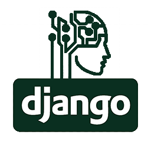

  
  <h1 align="center">Server-Django-Neuro</h1>

    
  

## License

Server-Django-Neuro is released under the [MIT License](https://github.com/UrijHoruzij/server-django-neuro/blob/master/LICENSE).
